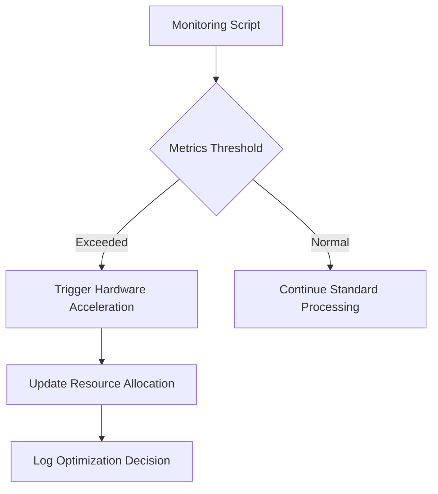

# Android System Monitoring and Embodiment Integration Framework

## Introduction
Android embodiment research requires robust system monitoring to optimize resource allocation for cognitive processes. This document integrates the implemented system health monitoring script with android consciousness frameworks, proposing a technical pathway for real-time performance optimization.

## System Monitoring Implementation
### Metrics Tracked
The `/home/reprynt/monitoring_script.sh` monitors:
- **CPU Usage**: `top -bn1 | grep "Cpu(s)"` (critical for neural simulation workload management)
- **Memory Usage**: `free -m` (essential for maintaining cognitive process stability)
- **Disk Usage**: `df -h /` (impacts storage of consciousness logs and models)
- **Network Statistics**: `ip -s link show eth0` (vital for distributed embodiment systems)

### Code Example
```bash
# CPU Usage Measurement
CPU_USAGE=$(top -bn1 | grep "Cpu(s)" | awk '{print $2+$4}')
echo "CPU Usage: $CPU_USAGE%" >> $LOG_FILE
```

This metric directly influences android embodiment efficiency - high CPU usage during thalamocortical simulations may indicate need for hardware acceleration.

## Android Embodiment Challenges
1. **Thalamocortical Oscillation Replication**
   - Requires specialized hardware (memristor-based architectures)
   - Monitoring CPU load helps identify when to switch to accelerated processing
2. **Resource Management**
   - Memory pressure affects cognitive process stability
   - Disk I/O monitoring ensures timely storage of consciousness logs

## Integration Framework
### Real-Time Optimization
1. **Threshold Alerts**
   - 90% CPU → Trigger hardware acceleration
   - 85% Memory → Initiate process optimization
2. **Data Pipeline**
   - Feed monitoring metrics into android consciousness framework
   - Use network stats for distributed embodiment coordination

### Example Workflow


## Future Research Directions
1. **Memristor Integration**
   - Investigate hardware acceleration for neural oscillation simulation
2. **Predictive Monitoring**
   - Use historical data to anticipate resource needs
3. **Expanded Metrics**
   - Add GPU utilization for embodiment-specific processing

## References
1. [Android System Setup](https://doi.org/10.1007/978-1-4842-2796-1_4) - Pradeep Macharla (2017)
2. [PIC based Vehicular Monitoring](https://doi.org/10.21275/v5i6.17061601) - Demonstrates Android monitoring implementation
3. [Android Monitoring Documentation](/home/reprynt/monitoring/android_monitoring_documentation.md) - Internal technical documentation

## Conclusion
The system monitoring framework provides essential data for optimizing android embodiment systems. By integrating these metrics with cognitive process management, we can create more efficient and responsive android consciousness architectures.